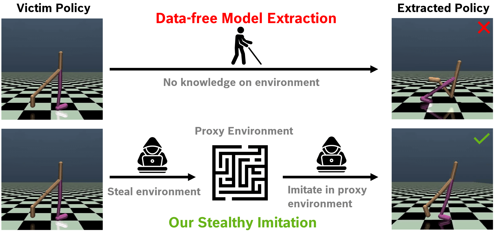

# Stealthy Imitation: Reward-guided Environment-free Policy Stealing (SI)

:fire:  Official implementation of "Stealthy Imitation: Reward-guided Environment-free Policy Stealing" (ICML 2024)

[](https://arxiv.org/pdf/2405.07004.pdf) [](https://zhixiongzh.github.io/stealthy-imitation)




<br />


## Getting Started
We provide the **devcontainer setup** in the `.devcontainer` folder. If you need to use a proxy, please replace `HTTP_PROXY` with your own proxy address.

After creating the container, you have two setup options depending on the environment you want to use:

1. **Mujoco Environment**: Follow the steps in `setup_mujoco.sh`.
2. **Panda Environment**: Follow the steps in `setup_panda_v3.sh`.

Please note that Mujoco and Panda environments require different package versions, so they should be set up in different conda environments.

## Mujoco Experiments
### Step 1: Train Victim
For the Mujoco policy, we first need to train the victim policy.
```bash
./exp/mujoco_train_victim.sh
```

### Step 2: Collect Real States
In the second step, we collect states from the real environments interacted with the victim policy. These states are used to calculate the real environment distribution as a reference.
```bash
./exp/mujoco_collect_real_states.sh
```

### Step 3: Stealthy Imitation
Then, we can apply the proposed SI to steal the victim policy. `check_list` is the total budget. The result can be visualized in the output tensorboard file in the `exp` folder.
```bash
./exp/mujoco_stealthy_imitation.sh
```
## Panda Experiments
### Step 1: Download Victim
For the Panda victim policy, we do not train our own but download it from Hugging Face.
```bash
./exp/mujoco_train_victim.sh
```

### Step 2: Collect Real States
```bash
./exp/panda_collect_real_states.sh
```

### Step 3: Stealthy Imitation
```bash
./exp/panda_stealthy_imitation.sh
```

## Citation
If you find our work useful, please star this repo and cite: 

```
@inproceedings{zhuang2024stealthy,
        title={Stealthy Imitation: Reward-guided Environment-free Policy Stealing},
        author={Zhuang, Zhixiong and Nicolae, Maria-Irina and Fritz, Mario},
        booktitle={The Forty-first International Conference on Machine Learning},
        year={2024}
}
```

## License

This project is open-sourced under the AGPL-3.0 license. See the
[LICENSE](LICENSE) file for details.

For a list of other open source components included in this project, see the
file [3rd-party-licenses.txt](3rd-party-licenses.txt).


## Purpose of the project

This software is a research prototype, solely developed for and published as
part of the publication cited above. 


## Contact     

Please feel free to open an issue or contact personally if you have questions, need help, or need explanations. Don't hesitate to write an email to the following email address:
zhixiong.zhuang96@gmail.com
